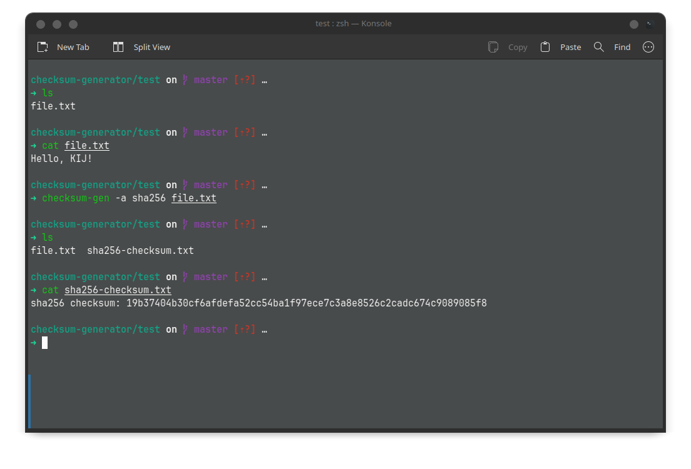
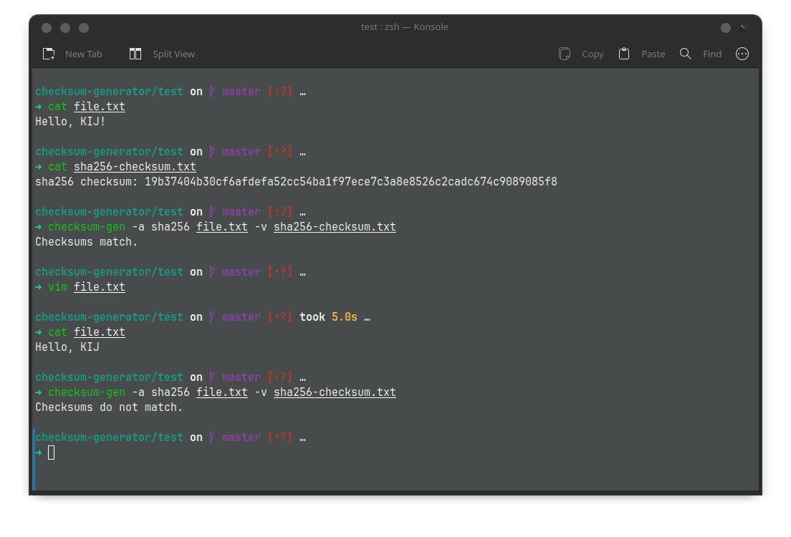

# Checksum Generator (checksum-gen)

**Checksum Generator (checksum-gen)** merupakan aplikasi untuk mencetak dan membandingkan checksum dari sebuah file. Aplikasi ini menyediakan pilihan beberapa algoritma hashing berikut:

1. MD5 (Message Diggest Algorithm 5)
2. SHA-256 (Secure Hash Algorithm - 256)
3. SHA-512 (Secure Hash Algorithm - 512)

## Instalasi

### Instalasi Manual

Untuk melakukan instalasi secara manual, clone repositori ini.

```bash
git clone git@github.com:fzl-22/checksum-generator.git
```

Masuk ke direktori project.

```bash
cd checksum-generator
```

Buat direktori `build`, kemudian masuk ke direktori tersebut.

```bash
mkdir build && cd build
```

Buat konfigurasi Makefile.

```bash
cmake -G "Unix Makefiles" ..
```

Compile dan build project ini.

```bash
make
```

Setelah itu, file binary dari project ini dapat diakses di [build/examples/checksum-gen](build/examples/checksum-gen). Pindahkan file ini ke `/usr/local/bin`.

```bash
cp examples/checksum-gen /usr/local/bin
```

Periksa instalasi dengan perintah `checksum-gen --version`.

### Instalasi Otomatis

Clone repositori ini. Kemudian, tambah izin eksekusi untuk user.

```bash
chmod u+x install.sh
```

Kemudian, jalankan script instalasi dengan privilege sudo.

```bash
sudo ./install.sh
```

Setelah selesai, periksa instalasi dengan perintah `checksum-gen --version`.

## Dokumentasi

```
Penggunaan: checksum-gen -a <algorithm> <filename> [-v <checksum_filename>]
```

### Mencetak checksum dari sebuah file

Untuk mencetak checksum dari sebuah file, jalankan perintah berikut:

```
checksum-gen -a <algorithm> <filename>
```

Opsi:

```
algorithm: md5, sha256, sha512
```

Contoh: Untuk mencetak checksum SHA-256 dari sebuah file `file.txt`.

```
checksum-gen -a sha256 file.txt
```

Program akan membuat sebuah file bernama `sha256-checksum.txt`.



### Memverifikasi file dari Checksum yang sudah ada

Untuk memverifikasi keaslian file dari checksum yang sudah ada, jalankan perintah berikut:

```
checksum-gen -a <algorithm> <filename> -v <checksum_filename>
```

Contoh: untuk memverifikasi keaslian file `file.txt` dari checksum SHA-256 yang sudah ada.

```
checksum-gen -a sha256 file.txt -v sha256-checksum.txt
```

Program akan mencetak "Checksum match." bila keaslian file `file.txt` terverifikasi. Sebaliknya, program akan mencatak "Checksum do not match.".



## Terimakasih
